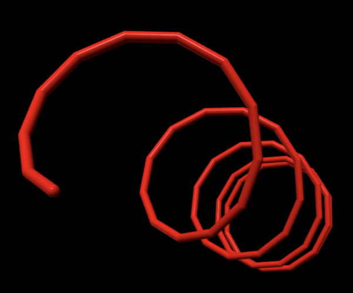

# Logo3D

Aquesta pàgina descriu la segona pràctica de GEI-LP (edició 2020-2021 Q2).
La vostra tasca és implementar un intèrpret d'un llenguatge de programació
anomenat Logo3D per permetre pintar amb una tortuga en 3D.


## Història

LOGO és un llenguatge de programació introduit cap el 1967
amb l'objectiu d'ensenyar a programar als infants
a través del joc i l'experimentació, introduint conceptes de matemàtiques,
com ara la geometria i la lògica de forma intuïtiva. Mitjançant els
gràfics de tortuga, els infants aprenien a programar i fins i tot
podien arribar de forma molt intuïtiva a utilitzar conceptes de programació
avançada, com ara la recursivitat.


## El llenguatge Logo3D: Tutorial

El llenguatge de programació Logo3D modernitza el LOGO clàssic adoptant una
nova i elegant sintàxi i situant la popular tortuga en un entorn 3D!

Per exemple, aquesta atractiva forma geomètrica en espiral



es pot obtenir amb aquest programa:

```
// Programa de demostracio en Logo3D.

PROC cercle(mida, costats) IS
    FOR i FROM 1 TO costats DO
        forward(mida)
        left(360 / costats)
    END
END

PROC espiral(cercles) IS
    IF cercles > 0 THEN
        cercle(1, 12)
        up(5)
        espiral(cercles - 1)
    END
END

PROC main() IS
    espiral(5)
END
```

La visualització de la forma es fa en un navegador, en el qual l'usuari pot
canviar de lloc i d'angle la càmara.

El següent programa mostra com llegir dos nombres i calcular el seu màxim comú
divisor utilitzant l'algorisme d'Euclides utilitzant dos
procediments i entrada/sortida:

```
// Programa principal.

PROC main() IS
    >> valor1 >> valor2
    euclides(valor1, valor2)
END


// Escriu el mcd de a i de b.

PROC euclides(a, b) IS
    WHILE a != b DO
        IF a > b THEN
            a := a - b
        ELSE
            b := b - a
        END
    END
    << a
END
```

Les variables són locals a cada invocació de cada procediment i els
procediments es poden comunicar a través de paràmetres.

Les variables no han de ser declararades, i són totes de tipus real.
Fixeu-vos que Logo3D utilitza l'autèntic operador d'assignació
que mai s'hauria d'haver abandonat:
el `:=`.

Com es veu a l'exemple, la sintàxi per llegir i escriure és utilitzant `>>` i
`<<` respectivament. Com que les instruccions no es separen ni acaben amb punts
i comes estupids, `>> a >> b` sembla un encadenament d'operacions però, en
realitat, són dues instruccions executades l'una rera l'altra.

Els comentaris comencen amb `//` i acaben al final de la seva línia.

A banda d'invocar procediments escrits per l'usuari, també es poden invocar
procediments que controlen una tortuga en l'espai tridimensional.
Per exemple, aquest procediment

```
PROC quadrat_blau(mida) IS
    color(0.2, 0.2, 1)
    FOR i FROM 1 TO 4 DO
        forward(mida)
        left(90)
    END
END
```

dibuixa un quadrat amb un delicat to blau (donat amb `color()`)
de la mida requerida tot movent la tortuga endavant (`forward`) i a l'esquerra
(`left`) quatre cops.

La tortuga (🐢) comença a l'orígen de les coordenades mirant horitzontalment cap a
la dreta i amb color roig. El seu rumb es pot canviar amb `left()` i `right()`
per l'angle horitzontal i amb `up()` i `down()` per l'angle vertical. Els angles es
dónen en graus. En l'estat normal, quan la tortuga avança o retrocedeix
(`forward` o `backward`), aquesta deixa un rastre del darrer color triat amb
`color` (que funciona amb valors RGB entre 0 i 1).  Cridant a `hide()`, la
tortuga deixa de pintar al moure's, amb `show()` torna a pintar. Es pot
recol·locar la tortuga al punt d'orígen amb `home()`.


## La vostra feina

La vostra feina consisteix en implementar un intèrpret de Logo3D que permeti
pintar amb una tortuga en 3D. Per escriure l'intèrpret heu d'utilitzar Python
i ANTLR4, tal com s'ha explicat a les classes de laboratori. Per crear les
escenes 3D utilitzareu [vpython](https://vpython.org/).  Per realitzar la vostra pràctica,  només
podeu utilitzar llibreries estàndards de Python, ANTLR4 i vpython.

Us proposem organitzar el vostre treball en tres fases:

1. Realització de l'intèrpret de Logo3D (sense tortuga). Cal escriure la gramàtica
   i els visitadors que recorrin l'AST d'un programa en Logo3D tot interpretant-lo.

2. Implementació una classe Turtle3D que doni suport a la creació
   d'escenes 3D a través d'una tortuga (totalment independent de l'intèrpret).

3. Extendre l'intèrpret per tal que permeti usar la classe Turtle3D.

Fixeu-vos que les fases 1 i 2 són totalment independents i no és fins a la
fase 3 que es posen en comú. Si heu separat bé 1 de 2, aquesta integració
hauria de ser ben senzilla.

A continuació s'especifiquen amb més detall els elements necessaris.


## Especificació de Logo3D

Les instruccions de Logo3D són:

- l'assignació,
- la lectura,
- l'escriptura,
- el condicional,
- la iteració amb `WHILE`,
- la iteració amb `FOR`, i
- la invocació a un procediment.

Les instruccions escrites una rera l'altra s'executen seqüencialment.


### Assignació

L'assignació ha d'avaluar primer l'expressió a la part dreta del `:=` i
enmagatzemar després el resultat a la variable local a la part esquerra.
Exemple: `perimetre := 2 * 3.1416 * radi`.


### Lectura

La instrucció de lectura ha de llegir un valor real del canal d'entrada
estàndard  i enmagatzemar-lo a la variable a la dreta del `>>`.
Exemple: `>> radi`.


### Escriptura

La instrucció d'escriptura ha d'avaluar l'expressió a la dreta del `<<` i
escriure-la, en una línia, al canal de sortida estàndard.
Exemple: `<< E * m * c * c`.


### Condicional

La instrucció condicional té la semàntica habitual. El bloc `ELSE` és optatiu.
Exemples: `IF x == y THEN z := 1 END` i `IF x == y THEN z := 1 ELSE z := 2 END`.

### Iteració amb `WHILE`

La instrucció iterativa amb `WHILE` té la semàntica habitual.
Exemple: `WHILE a > 0 DO a := a / 2 END`.


### Iteració amb `FOR`

La instrucció iterativa amb `FOR` té la semàntica habitual, tenint en compte
que els valors d'inici i de final es calculen abans d'iterar. Compte: El valor
de la variable de control pot ser canviat dins del cos de la iteració.
Exemple: `FOR i FROM 1 TO 5 DO i := 1 + 1 << i END`.


### Invocació de procediment


La crida a un procediment té la semàntica habitual.  Els paràmetres es passen
per valor, avaluant les expressions dels paràmetres d'esquerra a dreta.
Si el nombre de paràmetres passats
no corresponen als declarats, es produeix un error. Els procediments no són
funcions i no poden retornar resultats. Però els procediments es poden cridar
recursivament.
Exemple: `escriu(numero, 2)`.


### Expressions

Si una variable encara no ha rebut cap valor, el seu valor és zero. Els
operadors aritmètics són els habituals (`+`, `-`, `*`, `/`) i amb la mateixa
prioritat que en matemàtiques. Evidentment, es poden usar parèntesis. El
operadors relacionals (`==`, `!=`, `<`, `>`, `<=`, `>=`) retornen zero per
fals i u per cert. Quan cal interpretar un valor com a booleà (als `WHILE`s i
`IF`s), zero és fals, qualsevol altre valor és cert.


### Àmbit de visibilitat

No importa l'ordre de declaració dels procediments. Les variables són locals a
cada invocació de cada procediment. No hi ha variables globals ni manera
d'accedir a variables d'altres procediments.


### Errors

Malgrat que Logo3D és força senzill, els programadors poden realitzar molts
errors. Per aquesta pràctica, només us demanem que detecteu els errors més
verosímils (divisió per zero, crida a procediment no definit, repetició de
procediment ja definit, nombre de paràmetres incorrectes, noms de paràmetres
formals repetits, ...) i aborteu el programa amb una excepció quan es dónen.


### Invocació

El vostre intèrpret s'ha d'invocar amb la comanda `python3 logo3d.py` tot
passant-li com a paràmetre el nom del fitxer que conté el codi font
(l'extensió dels fitxsers per programes en Logo3D és `.l3d`). Per exemple:

```bash
python3 logo3d.py programa.l3d
```

Els programes poden començar des de qualsevol procediment.  Per defecte, es
comença pel procediment `main`.
Si es vol començar el programa des d'un procediment diferent de `main()`, cal donar el
seu nom com a segon paràmetre i es poden passar els valors dels seus paràmetres (nombre reals)
des de la linia de comandes.

```bash
python3 logo3d.py programa.l3d quadrats 10 20
```

### Extensions

Podeu extendre el llenguatge amb construccions del vostre gust, a condició de mantenir
una compatibilitat estricta amb l'especificació donada. A més, cal que documenteu
amb precisió les vostres extensions i que creeu programes que les provin i posin
de manifest la seva utilitat.

Per exemple, podríeu extendre Logo3D amb variables i/o constants globals,
operadors lògics, funcions que retornin valors, amb variables de tipus text,
...

Compte: Les extensions poden portar molta feina, consulteu-ho abans amb el vostre professor.


## Especificació de la classe Turtle3D

La vostra pràctica ha d'incloure un mòdul que ofereixi la classe `Turtle3D`. Aquesta classe
ha de ser totalment independent de l'intèrpret (tot i que aquest l'acabarà utilitzant).

Aquest és un exemple d'ús d'aquesta classe:

```python
from turtle3d import Turtle3D

turtle = Turtle3D()
for i in range(4):
    turtle.forward(10)
    turtle.right(90)
```

Les operacions que ha d'oferir aquesta classe són, essencialment, les operacions de la tortuga
que s'han descrit al tutorial. Bàsicament, per a cada segment que pinti la tortuga
cal posar un cilíndre en aquell segment amb dues esferes
del mateix radi al seu extrem (perquè quedi maco).

L'única llibreria no estàndard que heu utilitzar en aquesta fase és `vpython`.

Per dissenyar i implementar la classe `Turtle3D` haureu de prendre diverses decisions.

- decidir els atributs de la classe,
- especificar i documentar les operacions públiques,
- decidir les operacions privades...

Intenteu oferir un API ric, útil i ben documentat per aquesta classe.
Utilitzeu constants, constructors adeqüats, paràmetres opcionals, mètodes,
mètodes estàtics... i useu *docstrings* per la seva documentació.


## Exemple d'ús de `vpython`

Per instal·lar el mòdul `vpython`, feu

```bash
pip3 install vpython
```

Aquest programa mostra com utilitzar-lo:

```python
from vpython import *

# paràmetres de l'escena
scene.height = scene.width = 1000
scene.autocenter = True
scene.caption = """\nTo rotate "camera", drag with right button or Ctrl-drag.\nTo zoom, drag with middle button or Alt/Option depressed, or use scroll wheel.\n  On a two-button mouse, middle is left + right.\nTo pan left/right and up/down, Shift-drag.\nTouch screen: pinch/extend to zoom, swipe or two-finger rotate.\n"""

# posa els eixos de coordenades blancs
cylinder(pos=vector(0, 0, 0), axis=vector(10, 0, 0), radius=0.1, color=color.white)
cylinder(pos=vector(0, 0, 0), axis=vector(0, 10, 0), radius=0.1, color=color.white)
cylinder(pos=vector(0, 0, 0), axis=vector(0, 0, 10), radius=0.1, color=color.white)

# posa una esfera roja
bola = sphere(pos=vector(0, 0, 0), radius=0.5, color=color.red)

# mou la bola continuament
d = 0.1
while True:
    # si arriba als límits, canvia de direcció
    if bola.pos.x > 10 or bola.pos.x < 0:
        d = -d
    # canvia posició
    bola.pos.x += d
    rate(60)
```

Quan l'executeu, se us obrirà una finestra en un navegador on veureu com es mou la bola.
Podeu canviar les propietats de la càmara amb el ratolí.


## Integració de l'intèrpret amb la tortuga

No us hauria de costar gaire feina extendre l'intèrpret per tal que les comandes
relacionades amb la tortuga funcionin usant la classe `Turtle3D`.

Compte: L'intèrpret no hauria d'obrir la finestra gràfica si no hi ha cap
operació de tortuga. Igualment, si s'ha mostrat, la finestra gràfica ha de
continuar funcionant quan el programa que s'interpreta finalitza.


# Lliurament

Heu de lliurar la vostra pràctica al Racó. Només heu de lliurar un fitxer ZIP
que, al descomprimir-se generi:

- Un fitxer `requirements.txt` amb les llibreries que utilitza el vostre projecte
  - vegeu, per exemple, https://pip.pypa.io/en/stable/user_guide/#requirements-files.

- Un fitxer `README.md` que el documenti
  - vegeu, per exemple, https://www.makeareadme.com/.

- Un fitxer `logo3d.py` amb el programa principal de l'intèrpret.

- Un fitxer `logo3d.g` amb la gramàtica del LP.

- Un fitxer `visitor.g` amb el visitador de l'AST.

- Un fitxer `turtle3d.py` que contingui la classe `Turtle3D`.

- Si heu fet extensions, podeu afegir fitxers `test-***.l3d` com a exemples i jocs de proves.

Els vostres fitxers de codi en Python han de seguir les regles d’estı́l PEP8,
tot i que podeu oblidar les restriccions sobre la llargada màxima de les lı́nies.
Podeu utilitzar els paquets `pep8` o `autopep8` o http://pep8online.com/ per assegurar-vos
que seguiu aquestes regles d’estı́l. L’ús de tabuladors en el codi queda prohibit
(zero directe). Els vostres programes en Logo3D han de seguir l'estíl exposat en aquest
document, que demostra bon gust i *savoir-faire*.

El termini de lliurament és el **??? a les 23:59**.

Per evitar problemes de còpies,
no pengeu el vostre projecte en repositoris públics.


## Llibreries

Utilitzeu les llibreries de Python següents:

- `vpython` per fer els gràfics 3D.

- `ANTLR` per escriure la gramàtica i l'intèrpret.

Podeu utilitzar lliurament altres llibreries **estàndards** de Python.


# Referències

- ANTLR en Python: https://gebakx.github.io/Python3/compiladors.html#1

- vpython: https://www.glowscript.org/docs/VPythonDocs/index.html

- trigonometria 3d: https://stackoverflow.com/questions/30011741/3d-vector-defined-by-2-angles

